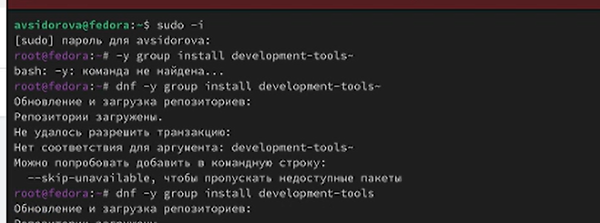
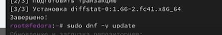
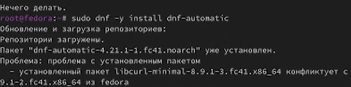
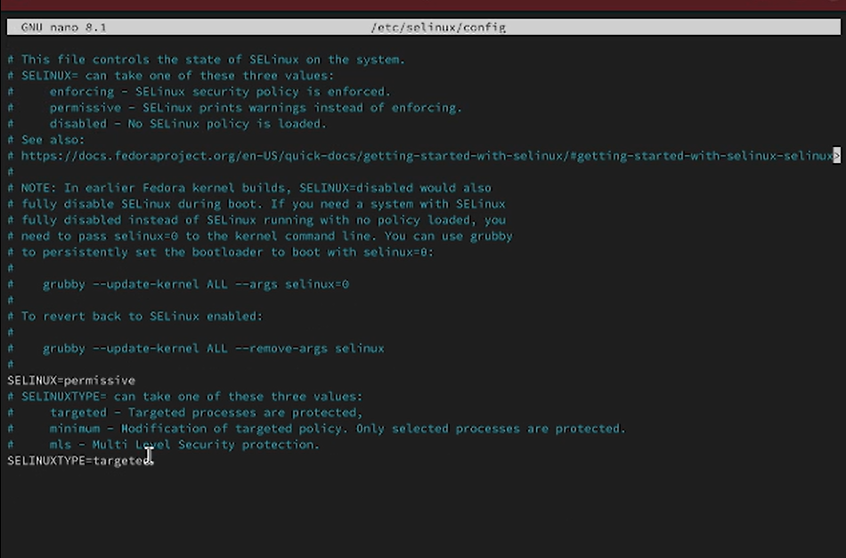
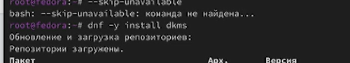
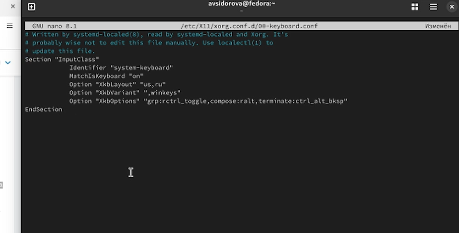
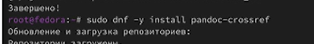
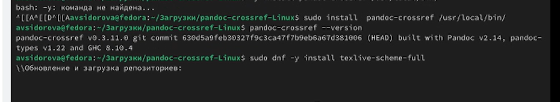
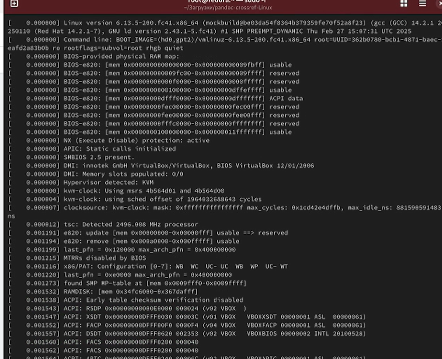
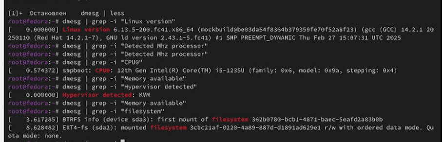

---
## Front matter
lang: ru-RU
title: Лабораторная работа номер 4
subtitle: Продвинутое использование git
author:
  - Сидорова Арина Валерьевна
institute:
  - Российский университет дружбы народов, Москва, Россия
date: 6 марта 2025

## i18n babel
babel-lang: russian
babel-otherlangs: english

## Formatting pdf
toc: false
toc-title: Содержание
slide_level: 2
aspectratio: 169
section-titles: true
theme: metropolis
header-includes:
 - \metroset{progressbar=frametitle,sectionpage=progressbar,numbering=fraction}
---

# Информация

## Докладчик

:::::::::::::: {.columns align=center}
::: {.column width="70%"}

  * Cидорова Арина Валерьевна
  * студентка НПИбд-02-24
  * студент кафедры прикладной информатики
  * Российский университет дружбы народов

:::
:::
::::::::::::::

# Вводная часть

## Цели и задачи

- Получение навыков правильной работы с репозиториями git.
- Выполнить работу для тестового репозитория.
- Преобразовать рабочий репозиторий в репозиторий с git-flow и conventional commits.

## Материалы и методы

- Процессор `pandoc` для входного формата Markdown
- Результирующие форматы
	- `pdf`
	- `html`
- Автоматизация процесса создания: `Makefile`

# Выполнение лабораторной работы

## Установка программного обеспечения

### Установка git-flow

- Установка из коллекции репозиториев Copr 

{#fig:001 width=70%}

{#fig:002 width=70%}

### Установка Node.js

- На Node.js базируется программное обеспечение для семантического версионирования и общепринятых коммитов. 

{#fig:004width=70%}

{#fig:005width=70%}

## Настройка Node.js

- Для работы с Node.js добавим каталог с исполняемыми файлами, устанавливаемыми yarn, в переменную PATH.

{#fig:006 width=70%}

## Общепринятые коммиты

### commitizen

- Данная программа используется для помощи в форматировании коммитов.

### standard-changelog

- Данная программа используется для помощи в создании логов. 

{#fig:007 width=70%}

## Создание репозитория git

Cоздаем репозиторий 
        
{#fig:008 width=70%}

- Делаем первый коммит и выкладываем на github
Конфигурация для пакетов Node.js
        
{#fig:009 width=70%}

### Сконфигурируем формат коммитов. Для этого добавим в файл package.json команду для формирования коммитов:
        
{#fig:010 width=70%}

### Добавим новые файлы, выполним коммит и отправим на гитхаб 
        
{#fig:011 width=70%}

### Инициализируем git-flow
        
{#fig:012 width=70%}

### Проверим, что Вы на ветке develop:
        
{#fig:013 width=70%}

### Загрузим весь репозиторий в хранилище:
        
{#fig:014 width=70%}

### Установим внешнюю ветку как вышестоящую для этой ветки:
        
{#fig:015 width=70%}

### Создадим релиз с версией 1.0.0
        
{#fig:016 width=70%}

### Создадим журнал изменений
        
{#fig:017 width=70%}

### Добавим журнал изменений в индекс
        
{#fig:018 width=70%}

### Зальём релизную ветку в основную ветку
        
{#fig:019 width=70%}

### Отправим данные на github
        
{#fig:020 width=70%}

### Отправим данные на github
        
{#fig:021 width=70%}

### Создадим релиз на github. Для этого будем использовать утилиты работы с github:
        
{#fig:022 width=70%}

## Работа с репозиторием git

### Создадим ветку для новой функциональности:
        
{#fig:023 width=70%}

### По окончании разработки новой функциональности следующим шагом следует объединить ветку feature_branch c develop 
        
{#fig:024 width=70%}

### Создадим релиз с версией 1.2.3:
- Добавим журнал изменений в индекс
- Зальём релизную ветку в основную ветку
        
{#fig:025 width=70%}

### Отправим данные на гитхаб
        
{#fig:026 width=70%}

### Создадим релиз на github с комментарием из журнала изменений:
        
{#fig:027 width=70%}

# Выводы
Получили навыки правильной работы с репозиториями git.

