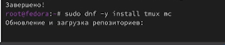

---
## Front matter
lang: ru-RU
title: Лабораторная работа номер 1
subtitle: Установка ОС Linux
author:
  - Сидорова Арина Валерьевна
institute:
  - Российский университет дружбы народов, Москва, Россия
date: 6 марта 2025

## i18n babel
babel-lang: russian
babel-otherlangs: english

## Formatting pdf
toc: false
toc-title: Содержание
slide_level: 2
aspectratio: 169
section-titles: true
theme: metropolis
header-includes:
 - \metroset{progressbar=frametitle,sectionpage=progressbar,numbering=fraction}
---

# Информация

## Докладчик

:::::::::::::: {.columns align=center}
::: {.column width="70%"}

  * Cидорова Арина Валерьевна
  * студентка НПИбд-02-24
  * студент кафедры прикладной информатики
  * Российский университет дружбы народов

:::
:::
::::::::::::::

# Вводная часть

## Цели и задачи

- приобретение практических навыков установки операционной системы на виртуальную машину, настройки минимально необходимых для дальнейшей работы сервисов.

## Материалы и методы

- Процессор `pandoc` для входного формата Markdown
- Результирующие форматы
	- `pdf`
	- `html`
- Автоматизация процесса создания: `Makefile`

# Выполнение лабораторной работы

## После установки виртуальной машины

Запустим терминальный мультиплексор tmux:
Переключимся на роль супер-пользователя:
Установите средства разработки:

{#fig:001 width=70%}

## Обновления 

{#fig:002 width=70%}

## Повышение комфорта работы 

Установка tmux mc 

{#fig:003 width=70%}

## Автоматическое обновление

Установка программного обеспечения 

{#fig:004 width=70%}

## Отключение SELinux

В файле /etc/selinux/config заменим значение
SELINUX=enforcing
на значение
SELINUX=permissive

{#fig:005 width=70%}

## Установка dkms

Устанавливаем dkms

{#fig:006 width=70%}

## Настройки раскладки клавиатуры

Отредактируем конфигурационный файл

{#fig:007 width=70%}

## Работа с языком разметки Markdown

Установим pandoc

{#fig:008 width=70%}

Установим pandoc-crossref

{#fig:009 width=70%}

Установка texlive

{#fig:010 width=70%}

# Домашнее задание

##  Дождитесь загрузки графического окружения и откройте терминал. В окне терминала проанализируйте последовательность загрузки системы, выполнив команду dmesg.

{#fig:011 width=70%}

##  Получить информацию:

- Версия ядра Linux (Linux version).
- Частота процессора (Detected Mhz processor).
- Модель процессора (CPU0).
- Объём доступной оперативной памяти (Memory available).
- Тип обнаруженного гипервизора (Hypervisor detected).
- Тип файловой системы корневого раздела.
- Последовательность монтирования файловых систем.

{#fig:012 width=70%}

# Вывод

Установила операционную систему Linux на виртуальную машину
