---
## Front matter
title: "Лабораторная работа №1"
subtitle: "Установка ОС Linux"
author: "Арина Валерьевна Сидорова"

## Generic otions
lang: ru-RU
toc-title: "Содержание"

## Bibliography
bibliography: bib/cite.bib
csl: pandoc/csl/gost-r-7-0-5-2008-numeric.csl

## Pdf output format
toc: true # Table of contents
toc-depth: 2
lof: true # List of figures
lot: true # List of tables
fontsize: 12pt
linestretch: 1.5
papersize: a4
documentclass: scrreprt
## I18n polyglossia
polyglossia-lang:
  name: russian
  options:
	- spelling=modern
	- babelshorthands=true
polyglossia-otherlangs:
  name: english
## I18n babel
babel-lang: russian
babel-otherlangs: english
## Fonts
mainfont: IBM Plex Serif
romanfont: IBM Plex Serif
sansfont: IBM Plex Sans
monofont: IBM Plex Mono
mathfont: STIX Two Math
mainfontoptions: Ligatures=Common,Ligatures=TeX,Scale=0.94
romanfontoptions: Ligatures=Common,Ligatures=TeX,Scale=0.94
sansfontoptions: Ligatures=Common,Ligatures=TeX,Scale=MatchLowercase,Scale=0.94
monofontoptions: Scale=MatchLowercase,Scale=0.94,FakeStretch=0.9
mathfontoptions:
## Biblatex
biblatex: true
biblio-style: "gost-numeric"
biblatexoptions:
  - parentracker=true
  - backend=biber
  - hyperref=auto
  - language=auto
  - autolang=other*
  - citestyle=gost-numeric
## Pandoc-crossref LaTeX customization
figureTitle: "Рис."
tableTitle: "Таблица"
listingTitle: "Листинг"
lofTitle: "Список иллюстраций"
lolTitle: "Листинги"
## Misc options
indent: true
header-includes:
  - \usepackage{indentfirst}
  - \usepackage{float} # keep figures where there are in the text
  - \floatplacement{figure}{H} # keep figures where there are in the text
---

# Цель работы

Целью данной работы является приобретение практических навыков установки операционной системы на виртуальную машину, настройки минимально необходимых для дальнейшей работы сервисов.

# Задание

Установить операционную систему linux на виртуальную машину

# Выполнение лабораторной работы

## После установки виртуальной машины

### tmux

Запустим терминальный мультиплексор tmux:
Переключимся на роль супер-пользователя:
Установите средства разработки:(рис. @fig:001).

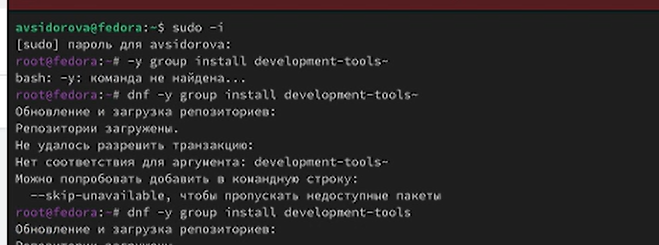{#fig:001 width=70%}

### Обновления (рис. @fig:002).

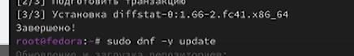{#fig:002 width=70%}

### Повышение комфорта работы 

Установка tmux mc (рис. @fig:003).

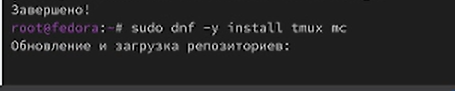{#fig:003 width=70%}

### Автоматическое обновление

Установка программного обеспечения (рис. @fig:004).

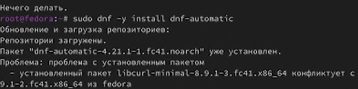{#fig:004 width=70%}

### Отключение SELinux

В файле /etc/selinux/config заменим значение
SELINUX=enforcing
на значение
SELINUX=permissive(рис. @fig:005).

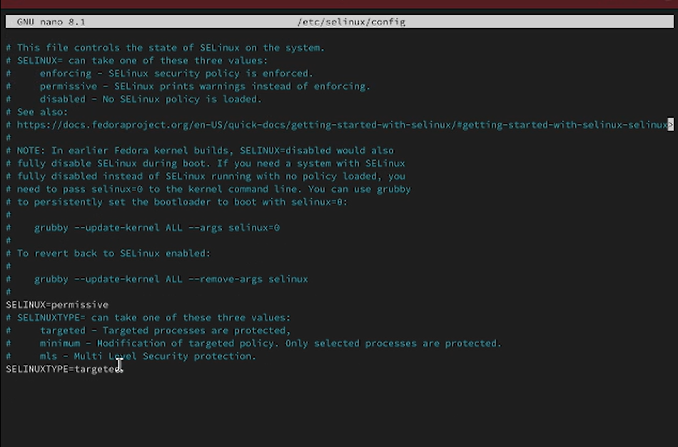{#fig:005 width=70%}

### Установка dkms

Устанавливаем dkms(рис. @fig:006).

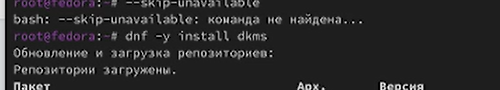{#fig:006 width=70%}

### Настройки раскладки клавиатуры

Отредактируем конфигурационный файл(рис. @fig:007).

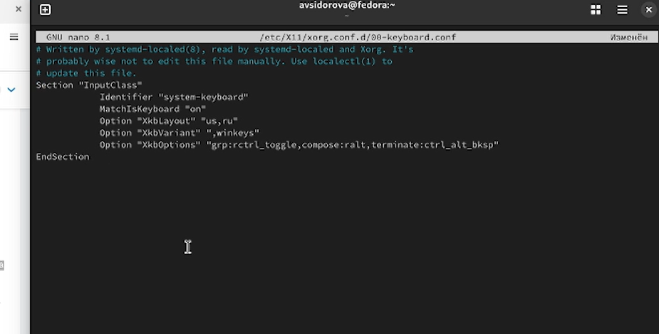{#fig:007 width=70%}

### Работа с языком разметки Markdown

Установим pandoc(рис. @fig:008).

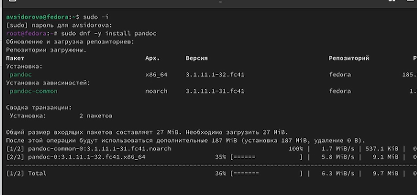{#fig:008 width=70%}

Установим pandoc-crossref(рис. @fig:009)

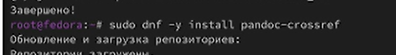{#fig:009 width=70%}

Установка texlive(рис. @fig:010)

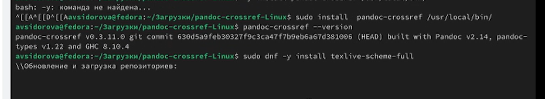{#fig:010 width=70%}

## Домашнее задание

###  Дождитесь загрузки графического окружения и откройте терминал. В окне терминала проанализируйте последовательность загрузки системы, выполнив команду dmesg.(рис @fig:011)

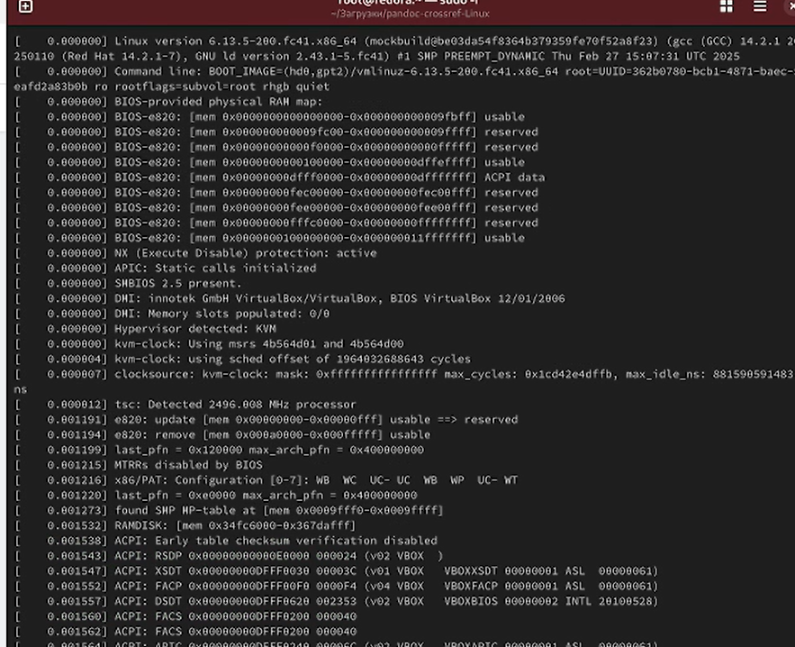{#fig:011 width=70%}

###  Получить информацию:(рис @fig:012)

- Версия ядра Linux (Linux version).
- Частота процессора (Detected Mhz processor).
- Модель процессора (CPU0).
- Объём доступной оперативной памяти (Memory available).
- Тип обнаруженного гипервизора (Hypervisor detected).
- Тип файловой системы корневого раздела.
- Последовательность монтирования файловых систем.

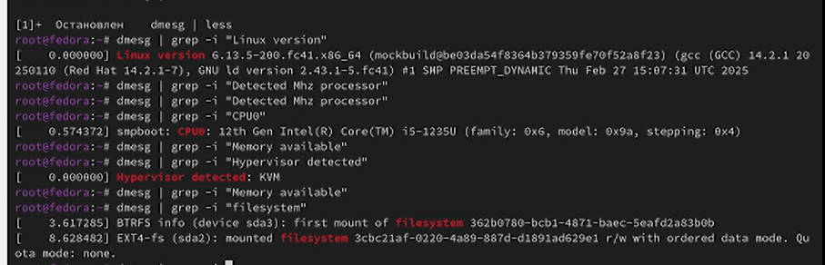{#fig:012 width=70%}

# Вывод

Установила операционную систему Linux на виртуальную машину

