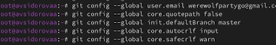

---
## Front matter
lang: ru-RU
title: Лабораторная работа номер 2
subtitle: Первоначальная настройка git
author:
  - Сидорова Арина Валерьевна
institute:
  - Российский университет дружбы народов, Москва, Россия
date: 6 марта 2025

## i18n babel
babel-lang: russian
babel-otherlangs: english

## Formatting pdf
toc: false
toc-title: Содержание
slide_level: 2
aspectratio: 169
section-titles: true
theme: metropolis
header-includes:
 - \metroset{progressbar=frametitle,sectionpage=progressbar,numbering=fraction}
---

# Информация

## Докладчик

:::::::::::::: {.columns align=center}
::: {.column width="70%"}

  * Cидорова Арина Валерьевна
  * студентка НПИбд-02-24
  * студент кафедры прикладной информатики
  * Российский университет дружбы народов

:::
:::
::::::::::::::

# Вводная часть

## Цели и задачи

- Изучить идеологию и применение средств контроля версий. 
- Приобрести практические навыки по работе с системой git.
- Установить программное обеспечение по работе с git
- Создать репозиторий для лабораторных работ.

## Материалы и методы

- Процессор `pandoc` для входного формата Markdown
- Результирующие форматы
	- `pdf`
	- `html`
- Автоматизация процесса создания: `Makefile`

# Выполнение лабораторной работы

## Установка git

- Установка git .

{#fig:001 width=70%}
## Установка gh 

- Установка gh  .

{#fig:002 width=70%}

:::

## Базовая настройка git

::: incremental

- Зададим имя и почту владельца репозитория .

{#fig:003 width=70%}

:::
- Настроим utf-8 в выводе сообщений git:
- Зададим имя начальной ветки (будем называть её master):
- Параметр autocrlf:
- Параметр safecrlf:

{#fig:005 width=70%}

## Создание ключей ssh

::: incremental

- по алгоритму rsa с ключём размером 4096 бит:
- по алгоритму ed25519:
{#fig:006 width=70%}

:::

## Создание ключей pgp

::: incremental

- Генерируем ключ
Из предложенных опций выбираем:
        тип RSA and RSA;
        размер 4096;
        выберите срок действия; значение по умолчанию — 0 (срок действия не истекает никогда).
GPG запросит личную информацию, которая сохранится в ключе:
        Имя (не менее 5 символов).
        Адрес электронной почты.
            При вводе email убедитесь, что он соответствует адресу, используемому на GitHub.
        Комментарий. Можно ввести что угодно или нажать клавишу ввода, чтобы оставить это поле пустым.
{#fig:007 width=70%}

:::

## Настройка автоматических подписей коммитов git.Настройка gh

- Используя введёный email, укажите Git применять его при подписи коммитов:
- git config --global user.signingkey <PGP Fingerprint>
- git config --global commit.gpgsign true
- git config --global gpg.program $(which gpg2)

## Настройка gh

- Для начала необходимо авторизоваться
- gh auth login
- Утилита задаст несколько наводящих вопросов.
- Авторизоваться можно через браузер.

{#fig:008 width=70%}

## Сознание репозитория курса на основе шаблона.Настройка каталога курса

- Необходимо создать шаблон рабочего пространства

{#fig:009 width=70%}

## Выводы
- Познакомились с системой git

