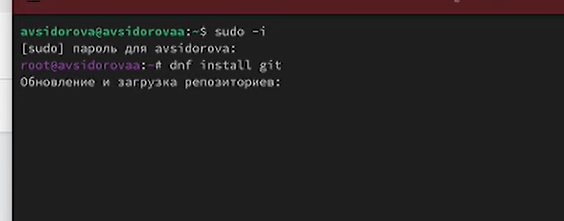
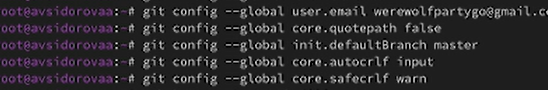
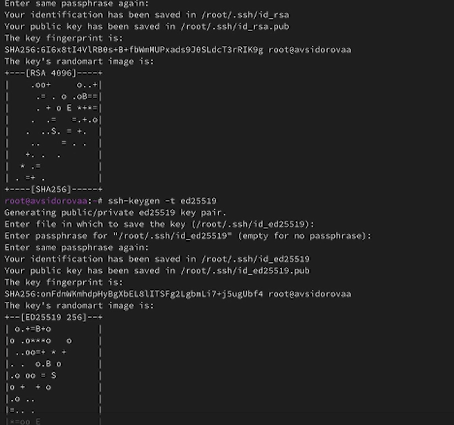
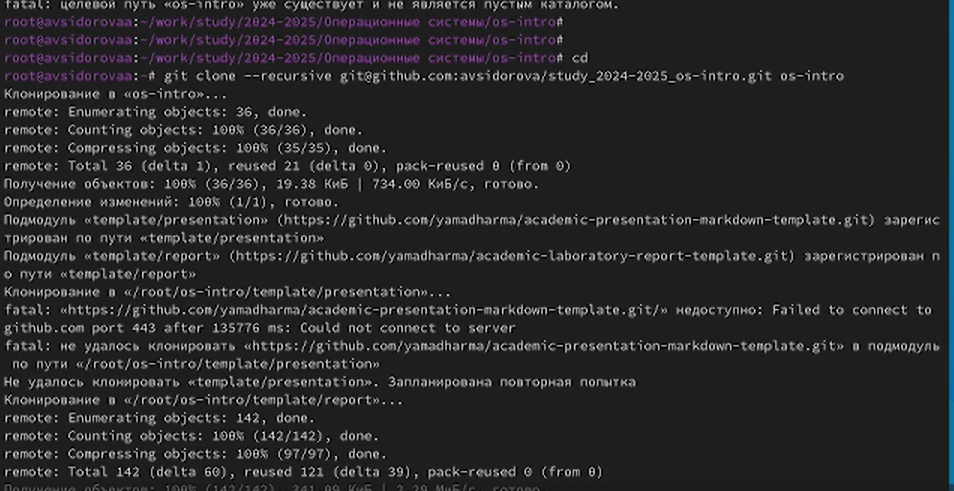

---
## Front matter
title: "Лабораторная работа №3"
subtitle: "Markdown"
author: "Арина Валерьевна Сидорова"

## Generic otions
lang: ru-RU
toc-title: "Содержание"

## Bibliography
bibliography: bib/cite.bib
csl: pandoc/csl/gost-r-7-0-5-2008-numeric.csl

## Pdf output format
toc: true # Table of contents
toc-depth: 2
lof: true # List of figures
lot: true # List of tables
fontsize: 12pt
linestretch: 1.5
papersize: a4
documentclass: scrreprt
## I18n polyglossia
polyglossia-lang:
  name: russian
  options:
	- spelling=modern
	- babelshorthands=true
polyglossia-otherlangs:
  name: english
## I18n babel
babel-lang: russian
babel-otherlangs: english
## Fonts
mainfont: IBM Plex Serif
romanfont: IBM Plex Serif
sansfont: IBM Plex Sans
monofont: IBM Plex Mono
mathfont: STIX Two Math
mainfontoptions: Ligatures=Common,Ligatures=TeX,Scale=0.94
romanfontoptions: Ligatures=Common,Ligatures=TeX,Scale=0.94
sansfontoptions: Ligatures=Common,Ligatures=TeX,Scale=MatchLowercase,Scale=0.94
monofontoptions: Scale=MatchLowercase,Scale=0.94,FakeStretch=0.9
mathfontoptions:
## Biblatex
biblatex: true
biblio-style: "gost-numeric"
biblatexoptions:
  - parentracker=true
  - backend=biber
  - hyperref=auto
  - language=auto
  - autolang=other*
  - citestyle=gost-numeric
## Pandoc-crossref LaTeX customization
figureTitle: "Рис."
tableTitle: "Таблица"
listingTitle: "Листинг"
lofTitle: "Список иллюстраций"
lolTitle: "Листинги"
## Misc options
indent: true
header-includes:
  - \usepackage{indentfirst}
  - \usepackage{float} # keep figures where there are in the text
  - \floatplacement{figure}{H} # keep figures where there are in the text
---

# Цель работы

Изучить идеологию и применение средств контроля версий. Приобрести практические навыки по работе с системой git.

# Задание

Установить программное обеспечение по работе с git,создать репозиторий для лабораторных работ.

# Выполнение лабораторной работы

## Установка программного обеспечения

### Установка git

Установка git  (рис. @fig:001).

{#fig:001 width=70%}

### Установка gh 

Установка gh  (рис. @fig:002).

{#fig:002 width=70%}

## Базовая настройка git

Зададим имя и почту владельца репозитория (рис. @fig:003).

{#fig:003 width=70%}

Настроим utf-8 в выводе сообщений git:

git config --global core.quotepath false

Зададим имя начальной ветки (будем называть её master):

git config --global init.defaultBranch master

Параметр autocrlf:

git config --global core.autocrlf input

Параметр safecrlf:

git config --global core.safecrlf warn(рис. @fig:005).

{#fig:005 width=70%}

## Создание ключей ssh
по алгоритму rsa с ключём размером 4096 бит:
ssh-keygen -t rsa -b 4096

по алгоритму ed25519:

ssh-keygen -t ed25519(рис. @fig:006).

{#fig:006 width=70%}

## Создание ключей pgp
Генерируем ключ
gpg --full-generate-key
Из предложенных опций выбираем:
        тип RSA and RSA;
        размер 4096;
        выберите срок действия; значение по умолчанию — 0 (срок действия не истекает никогда).
GPG запросит личную информацию, которая сохранится в ключе:
        Имя (не менее 5 символов).
        Адрес электронной почты.
            При вводе email убедитесь, что он соответствует адресу, используемому на GitHub.
        Комментарий. Можно ввести что угодно или нажать клавишу ввода, чтобы оставить это поле пустым.(рис. @fig:007).
        
{#fig:007 width=70%}

## Настройка автоматических подписей коммитов git.Настройка gh

Используя введёный email, укажите Git применять его при подписи коммитов:
git config --global user.signingkey <PGP Fingerprint>
git config --global commit.gpgsign true
git config --global gpg.program $(which gpg2)
Настройка gh
Для начала необходимо авторизоваться
gh auth login
Утилита задаст несколько наводящих вопросов.
Авторизоваться можно через браузер.(рис. @fig:008).

{#fig:008 width=70%}

## Сознание репозитория курса на основе шаблона.Настройка каталога курса

Необходимо создать шаблон рабочего пространства(рис. @fig:009)

{#fig:009 width=70%}

# Выводы
Познакомились с системой git

