---
## Front matter
title: "Лабораторная работа №4"
subtitle: "Продвинутое использование git"
author: "Арина Валерьевна Сидорова"

## Generic otions
lang: ru-RU
toc-title: "Содержание"

## Bibliography
bibliography: bib/cite.bib
csl: pandoc/csl/gost-r-7-0-5-2008-numeric.csl

## Pdf output format
toc: true # Table of contents
toc-depth: 2
lof: true # List of figures
lot: true # List of tables
fontsize: 12pt
linestretch: 1.5
papersize: a4
documentclass: scrreprt
## I18n polyglossia
polyglossia-lang:
  name: russian
  options:
	- spelling=modern
	- babelshorthands=true
polyglossia-otherlangs:
  name: english
## I18n babel
babel-lang: russian
babel-otherlangs: english
## Fonts
mainfont: IBM Plex Serif
romanfont: IBM Plex Serif
sansfont: IBM Plex Sans
monofont: IBM Plex Mono
mathfont: STIX Two Math
mainfontoptions: Ligatures=Common,Ligatures=TeX,Scale=0.94
romanfontoptions: Ligatures=Common,Ligatures=TeX,Scale=0.94
sansfontoptions: Ligatures=Common,Ligatures=TeX,Scale=MatchLowercase,Scale=0.94
monofontoptions: Scale=MatchLowercase,Scale=0.94,FakeStretch=0.9
mathfontoptions:
## Biblatex
biblatex: true
biblio-style: "gost-numeric"
biblatexoptions:
  - parentracker=true
  - backend=biber
  - hyperref=auto
  - language=auto
  - autolang=other*
  - citestyle=gost-numeric
## Pandoc-crossref LaTeX customization
figureTitle: "Рис."
tableTitle: "Таблица"
listingTitle: "Листинг"
lofTitle: "Список иллюстраций"
lolTitle: "Листинги"
## Misc options
indent: true
header-includes:
  - \usepackage{indentfirst}
  - \usepackage{float} # keep figures where there are in the text
  - \floatplacement{figure}{H} # keep figures where there are in the text
---

# Цель работы

Получение навыков правильной работы с репозиториями git.

# Задание

- Выполнить работу для тестового репозитория.
- Преобразовать рабочий репозиторий в репозиторий с git-flow и conventional commits.
.
# Выполнение лабораторной работы

## Установка программного обеспечения

### Установка git-flow

Установка из коллекции репозиториев Copr (рис. @fig:001).

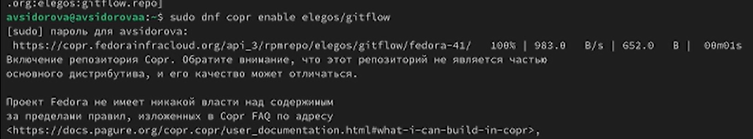{#fig:001 width=70%}

(рис. @fig:002).

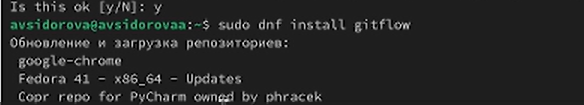{#fig:002 width=70%}

### Установка Node.js

На Node.js базируется программное обеспечение для семантического версионирования и общепринятых коммитов. (рис. @fig:004).

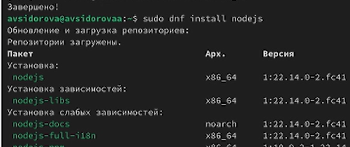{#fig:004width=70%}

(рис. @fig:005).

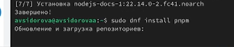{#fig:005width=70%}

## Настройка Node.js

Для работы с Node.js добавим каталог с исполняемыми файлами, устанавливаемыми yarn, в переменную PATH.(рис. @fig:006).

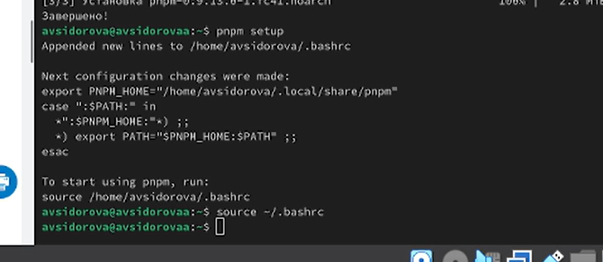{#fig:006 width=70%}

## Общепринятые коммиты

### commitizen

- Данная программа используется для помощи в форматировании коммитов.

### standard-changelog

- Данная программа используется для помощи в создании логов. (рис. @fig:007).

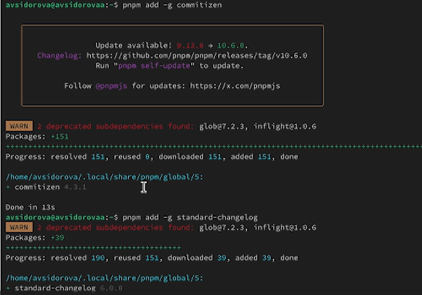{#fig:007 width=70%}

## Создание репозитория git

Cоздаем репозиторий (рис. @fig:008).
        
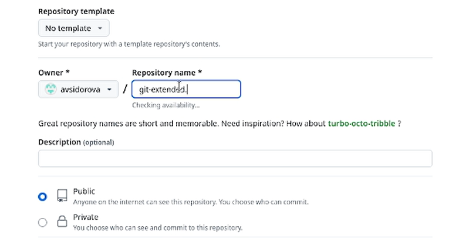{#fig:008 width=70%}

Делаем первый коммит и выкладываем на github
Конфигурация для пакетов Node.js(рис. @fig:009).
        
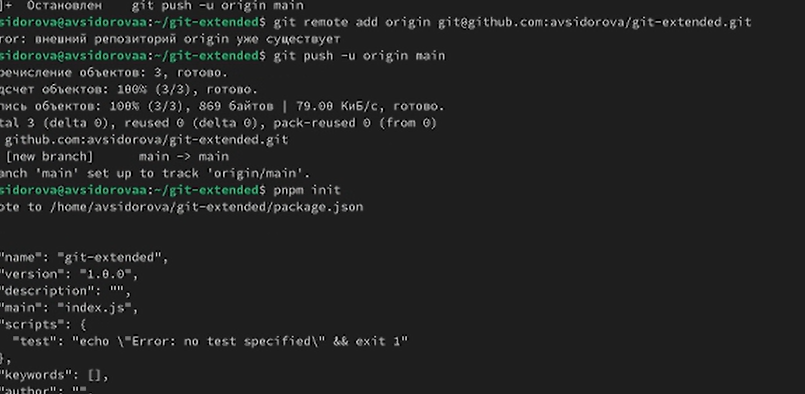{#fig:009 width=70%}

Сконфигурируем формат коммитов. Для этого добавим в файл package.json команду для формирования коммитов:(рис. @fig:010).
        
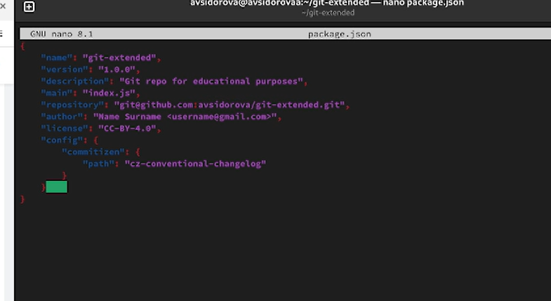{#fig:010 width=70%}

Добавим новые файлы, выполним коммит и отправим на гитхаб (рис. @fig:011).
        
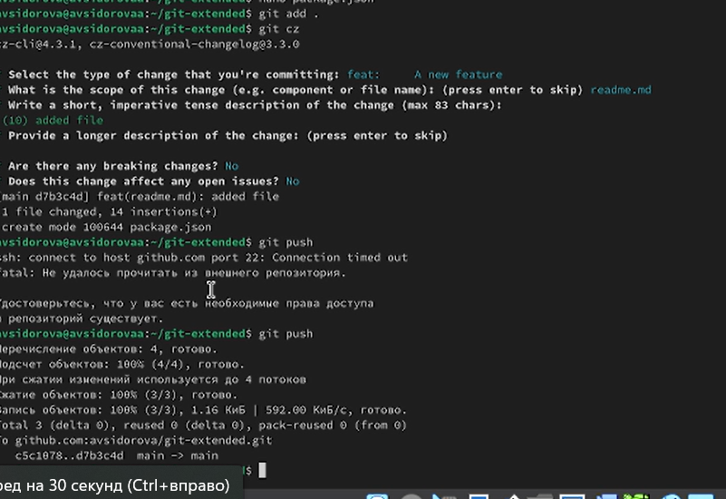{#fig:011 width=70%}

Инициализируем git-flow(рис. @fig:012).
        
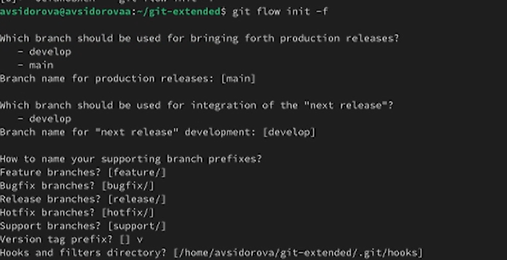{#fig:012 width=70%}

Проверим, что Вы на ветке develop:(рис. @fig:013).
        
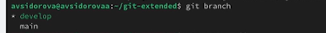{#fig:013 width=70%}

Загрузим весь репозиторий в хранилище:(рис. @fig:014).
        
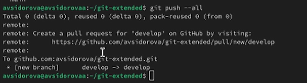{#fig:014 width=70%}

Установим внешнюю ветку как вышестоящую для этой ветки:(рис. @fig:015).
        
{#fig:015 width=70%}

Создадим релиз с версией 1.0.0(рис. @fig:016).
        
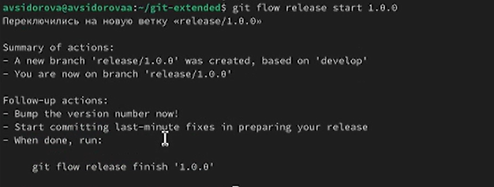{#fig:016 width=70%}

Создадим журнал изменений(рис. @fig:017).
        
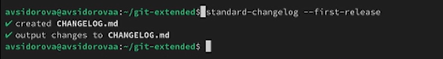{#fig:017 width=70%}

Добавим журнал изменений в индекс(рис. @fig:018).
        
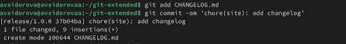{#fig:018 width=70%}

Зальём релизную ветку в основную ветку(рис. @fig:019).
        
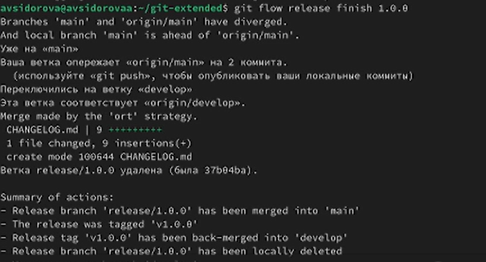{#fig:019 width=70%}

Отправим данные на github(рис. @fig:020).
        
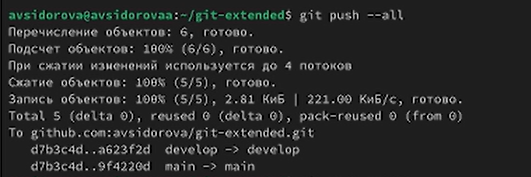{#fig:020 width=70%}

Отправим данные на github(рис. @fig:021).
        
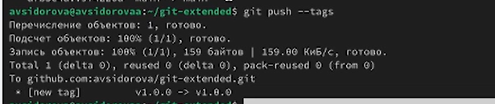{#fig:021 width=70%}

Создадим релиз на github. Для этого будем использовать утилиты работы с github:(рис. @fig:022).
        
{#fig:022 width=70%}

## Работа с репозиторием git

Создадим ветку для новой функциональности:(рис. @fig:023).
        
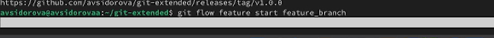{#fig:023 width=70%}

По окончании разработки новой функциональности следующим шагом следует объединить ветку feature_branch c develop (рис. @fig:024).
        
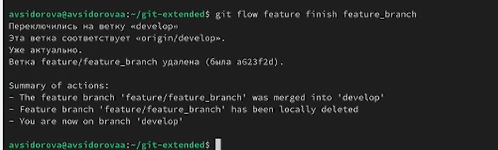{#fig:024 width=70%}

Создадим релиз с версией 1.2.3:
Добавим журнал изменений в индекс
Зальём релизную ветку в основную ветку(рис. @fig:025).
        
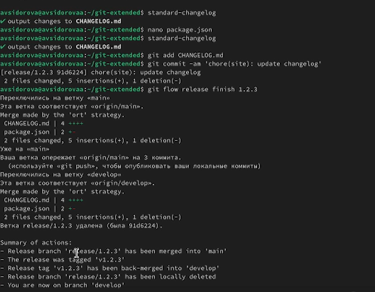{#fig:025 width=70%}

Отправим данные на гитхаб(рис. @fig:026).
        
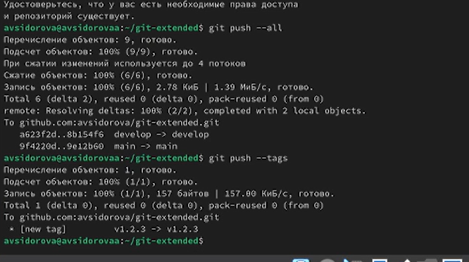{#fig:026 width=70%}

Создадим релиз на github с комментарием из журнала изменений:(рис. @fig:027).
        
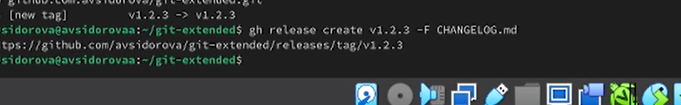{#fig:027 width=70%}

# Выводы
Получили навыки правильной работы с репозиториями git.

